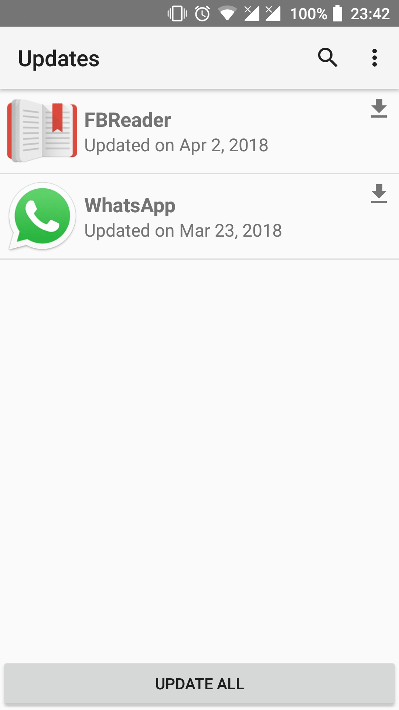
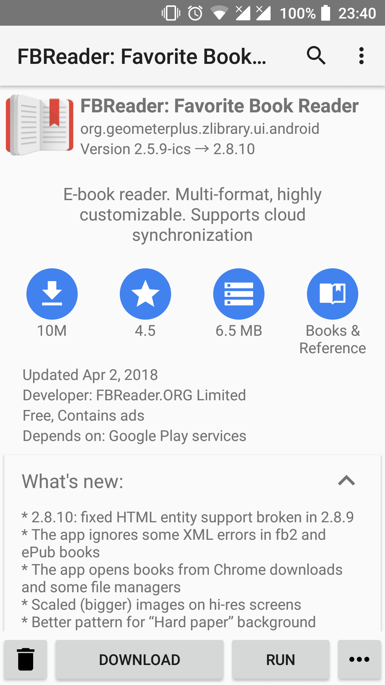

# Yalp Store   

 

## What does it do?
Yalp Store lets you download apps from Google Play Store **as apk files**. It can search for **updates** of installed apps and lets you **search** for other apps. Yalp saves downloaded apks to your default download folder. Other features include browsing categories, viewing and leaving reviews, black/whitelisting apps for updates, filtering apps by being free/paid and containing/not containing ads.

To supplement the features related to Google Play, Yalp Store has ordinary package manager features: listing, running, installing and uninstalling local apps.

If root is available, Yalp Store can update your apps in background, install and uninstall system apps.

Yalp Store can be installed as a system app to gain background package installation permission. In ths case "Unknown sources" setting can be left off. You can let Yalp Store self-install as a system app, or get the OTA zip from the [releases page](https://github.com/yeriomin/YalpStore/releases).

## Why would I use it?
If you are content with Google Play Store app, you will not need this app.

The point of Yalp Store is to be small and independent from Google Services Framework. As time passed, Google Services Framework and Google Play Store apps grew in size, which made them almost too big for old phones (Nexus One has 150Mb memory available for apps, half of it would be taken by Google apps). Another reason to use Yalp Store is if you frequently flash experimental ROMs. This often breaks gapps and even prevents their reinstallation. In this situation Yalp will still work.

## How does it work?
Yalp Store uses the same (protobuf) API the android Play Store app uses. It downloads apks **directly** from Google servers.

By default Yalp Store connects to Google services using a built-in account, so **you do not have to own a Google account to use it**. The only reason to use a live Google account is to access the paid apps you own.

Each time you log in a new Google Services Framework id (also known as device id) is generated using your device parameters. The list of parameters Google requires for that is rather long ([example](https://github.com/yeriomin/play-store-api/blob/master/src/main/resources/device-sailfish.properties)). They are used for app filtering and compatibility checks *on the server side*. It is possible to mimic a different device. In Yalp Store settings you will find a list of bundled device definitions. Note that no personal info is disclosed, only technical information about your device.

When the GSF id is ready, your email and password (if you provided them) are used to generate an authorization token. The authorization token is used to sign all Play Store API requests. Your password is used only once and is not stored, the token is enough for all the requests.

## Screenshots

## FAQ
>Q: What about buying apps, books, music, movies? Is it going to be implemented at some point?
>
>A: No. Only free apps and apps you have purchased are going to be accessible through Yalp Store. Google Play API is not open and is not documented, so Yalp Store is developed through reverse-engineering. To implement features related to anything that requires payment I would have to (very) frequently buy stuff from Google Play Store. 

>Q: Even though I granted the write permission to Yalp Store, it still says "Downloads directory could not be created or is not writable." How do I download anything?
>
>A: Try force-closing Yalp Store and launching it again. If it doesn't help, read [this discussion](https://github.com/yeriomin/YalpStore/issues/308).

>Q: I cannot download files! Downloads start but do not progress or stop midway. / I'm having error 495. / I don't like Android built-in DownloadManager. Is Yalp going to have its own download manager?
>
>A: Try turning off VPN or ad-blocking apps first. Yalp already **has** a mini download manager. It is used as a fallback when system DownloadManager is disabled or unavailable for any other reason. You can force Yalp to use the fallback download manager like this: Settings -> Apps -> Show system -> Download Manager -> Disable. Setting download location to internal storage also turns the fallback on. I'm not setting the fallback as default because it is very minimalisic and is never going to be as well-tested and feature-rich as the system DownloadManager.

>Q: Some apps are not getting the latest release available on Play Store. What do I do?
>
>A: For different reasons the app developer might choose not to release his app for all users at the same time. This is called a [staged rollout](https://support.google.com/googleplay/android-developer/answer/6346149?hl=en). Be patient, the update will come.

>Q: I would like to spoof device X. Can you add its definition to Yalp Store?
>
>A: There is an extended library of devices [here](https://github.com/yeriomin/play-store-api/find/alldevices). If you found your device, put it into your downloads directory and it will appear in Yalp Store spoof device list. Note that the files are named by device codenames which might not be the same as the names with which the devices are sold, for example codename of Nexus 5X is bullhead. Also, the device definitions are simple text files, so if you know *exactly* what you need to spoof, you can just edit them by hand. Note that all the devices in the above mentioned list were submitted by users, so if you haven't found the device you wanted, you are out of luck. I cannot create a device definition on demand.

>Q: Can Yalp Store download region-locked apps?
>
>A: Not directly. But it is easier than with Play Store. Play Store servers detect your location by your ip address, so to appear to be in a different region you are going to need a VPN. Log out of Yalp Store (clearing Yalp Store app data does the same thing). Turn your VPN solution on and choose a desired location. Log in to Yalp Store again. You should be able to download apps from your chosen region now.

>Q: Is it **legal** to use Yalp Store with my own Google account?
>
>A: No. Yalp Store violates [§3.3 of Google Play Terms of Service](https://www.google.com/mobile/android/market-tos.html). Your account might be disabled, robbing you of any apps you have purchased.

>Q: Is it **safe** to use Yalp Store with my own Google account?
>
>A: Yes. Software like Yalp Store, Google Play Crawler and Raccoon has been used for years and it seems to be safe. Never heard of any real cases of accounts being disabled.

## License

Yalp Store is Free Software: You can use, study share and improve it at your will. Specifically you can redistribute and/or modify it under the terms of the GNU General Public License as published by the Free Software Foundation, either version 2 of the License, or (at your option) any later version.

## Dependencies

* [play-store-api](https://github.com/yeriomin/play-store-api) - Google Play Store API wrapper library
* [Apache Commons Net](https://commons.apache.org/proper/commons-net/) - used to send bug reports
* [libsuperuser](https://github.com/Chainfire/libsuperuser) - used to work with root
* [javaxdelta](https://sourceforge.net/projects/xdelta/) - used to work with delta updates
